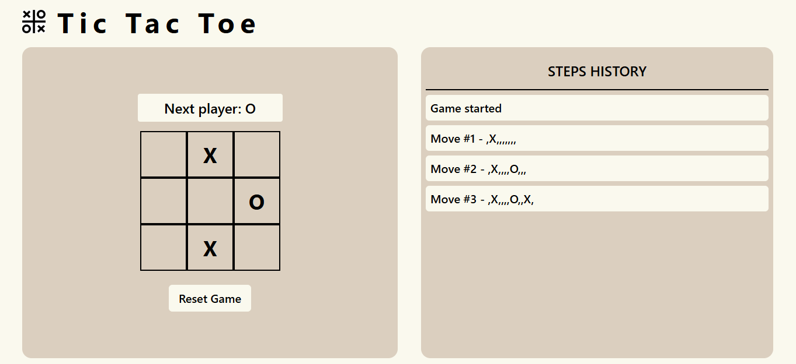
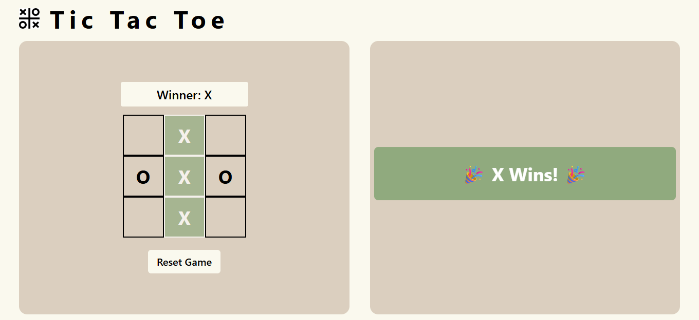
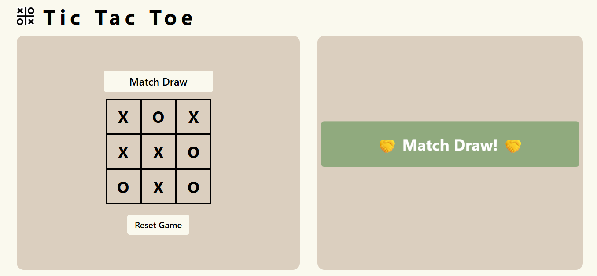

````markdown
# Tic-Tac-Toe Game (React + Tailwind CSS)

[](https://reactjs.org/)  
[](https://tailwindcss.com/)

A responsive and interactive Tic-Tac-Toe game built with **React** and **Tailwind CSS**. The game features dynamic animations, move history, winner/draw detection, and a reset functionality.

---

## 🎮 Features

- **Interactive Gameplay**: Click squares to place 'X' or 'O'.
- **Next Player / Winner / Draw**: Status bar shows the next player, winner, or a match draw.
- **Winning Animation**: Winning squares highlight with a pulse animation.
- **Draw Detection**: Automatically detects a draw when all squares are filled.
- **Move History**: Steps performed during the game are recorded (hidden on game over).
- **Reset Game**: Restart the game at any time.
- **Responsive Design**: Clean and responsive UI using Tailwind CSS.

---

## 📸 Screenshots

  
*Game in progress with current player X.*


  
*Winner displayed with animation.*

  
*Match draw scenario.*

---

## 💻 Installation

1. **Clone the repository**
   ```bash
   git clone https://github.com/your-username/tic-tac-toe-react.git
````

2. **Navigate to the project directory**

   ```bash
   cd tic-tac-toe-react
   ```
3. **Install dependencies**

   ```bash
   npm install
   ```
4. **Start the development server**

   ```bash
   npm start
   ```
5. Open the app in your browser at [http://localhost:3000](http://localhost:3000)

---

## 🛠️ Usage

* Click on any square to place your mark (X or O).
* The game automatically detects winners or draws.
* Steps history is displayed in the right panel until the game ends.
* Click the **Reset Game** button to start a new match.

---

## 🗂️ Folder Structure

```
tic-tac-toe-react/
├─ src/
│  ├─ assets/       # Images like logo
│  ├─ components/   # React components (optional)
│  ├─ App.js        # Main game component
│  └─ index.js      # Entry point
├─ public/          # Public files
├─ package.json
└─ README.md
```

---

## ⚡ Technologies Used

* [React](https://reactjs.org/)
* [Tailwind CSS](https://tailwindcss.com/)
* JavaScript (ES6+)
* HTML5 & CSS3


---

## 🎉 Enjoy playing Tic-Tac-Toe!


```
